# AutoPareto

A two-stage single-cell RNA-seq analysis pipeline for transferring cell type annotations from a reference atlas and performing **Archetypal Analysis ** to identify extreme gene expression programs within a population.

---

## Overview

```
Raw Counts (query + reference)
        │
        ▼
[Stage 1 — R] 
        │  Seurat anchor-based label transfer
        ▼
[Stage 2 — Python]  notebooks/tutorial.ipynb
        │  QC checks
        │  Normalization, HVG selection, PCA
        │  Archetypal Analysis (partipy)
        │  DEG per archetype (1-vs-rest + pairwise)
        │  GO enrichment (ORA + GSEA)
        ▼
     Results
```

---

## Repository Structure

```
Parti_pipeline/           
├── environment/            # Conda/pip environment files
├── notebooks/
│   └── tutorial_stage1.R          # R Commands for annotation transfer
|   ├── tutorial_stage2.ipynb      # Main python analysis notebook (Stage 2)
├── scripts/
│   ├── utils_R.R                  # R utility functions (load_seurat, plot_qc, preprocess_and_run_transferanchor(etc.)
│   └── utils.py                   # Python utility functions (AA, DEG, GO, etc.)
└── README.md
```

---

## Dependencies

### R (Stage 1)
```r
install.packages(c("Seurat", "SeuratDisk", "Matrix", "optparse", "dplyr"))
BiocManager::install("glmGamPoi")   # optional but recommended for SCT
```

### Python (Stage 2)
```bash
conda env create -f environment/environment_py.yml
conda activate parti
# or manually:
pip install scanpy partipy gseapy anndata pandas numpy matplotlib scipy
```

---

## Stage 1 — Annotation Transfer (R)

### Walkthrough

```r
source("scripts/utils_R.R")
```

#### 1. Load reference and query
Reference dataset should contain the metadata column that you intend to use to annotate your (query) dataset.

```r
ref <- load_seurat(
  counts_path = "data/ref/raw/counts.csv.gz",
  meta_path   = "data/ref/raw/metadata.csv.gz",
)

query <- load_seurat(
  counts_path = "data/test/query_counts.csv.gz",
  meta_path   = "data/test/query_metadata.csv.gz",
)
```

> If your counts matrix is cells × genes instead of genes × cells, pass `transpose = TRUE`.

#### 2. QC

```r
# adds pct.mt and pct.ribo to metadata, returns seu with those columns attached
ref   <- plot_qc(ref,   mt_pattern = "^mt-", ribo_pattern = "^Rp[sl]")
query <- plot_qc(query, mt_pattern = "^mt-", ribo_pattern = "^Rp[sl]")
```

Inspect the violin and scatter plots, then filter:

```r
ref   <- subset(ref,   nFeature_RNA > 500 & nFeature_RNA < 6000 & pct.mt < 15)
query <- subset(query, nFeature_RNA > 500 & nFeature_RNA < 6000 & pct.mt < 15)
```

Typical thresholds for mouse brain:

| Metric | Filter |
|---|---|
| `nFeature_RNA` | 500 – 6000 |
| `pct.mt` | < 15% |
| `pct.ribo` | < 50% |

#### 3. Transfer annotations

```r
query <- preprocess_and_run_transferanchor(
  query           = query,
  reference       = ref,
  normalization   = "lognorm",        # or "SCT"
  ref_label_col   = "cell_subclass",  # column in ref metadata to transfer
  query_label_col = "predicted_subclass",
  dims            = 1:30,
  n_features      = 3000
)
```

This runs: normalization → variable features → scaling → PCA → `FindTransferAnchors` → `TransferData` on both objects. The query is returned with `predicted_subclass` and `prediction.score.*` columns added to metadata.

#### 4. Export for Python

```r
save_annotated_data(
  seu                = query,
  counts_output_file = "data/processed/query_counts.csv",
  meta_output_file   = "data/processed/query_metadata.csv"
)
```

These two files are the inputs to Stage 2.

### Function reference

| Function | Description |
|---|---|
| `load_seurat(counts_path, meta_path, transpose, project)` | Load counts + metadata into a Seurat object |
| `plot_qc(seu, mt_pattern, ribo_pattern, group_by)` | Plot QC violins and scatter plots; adds `pct.mt`, `pct.ribo` to metadata |
| `preprocess_and_run_transferanchor(query, reference, ...)` | Full preprocessing + anchor-based label transfer |
| `save_annotated_data(seu, counts_output_file, meta_output_file)` | Export counts and metadata as CSVs for Python |

## Stage 2 — Archetypal Analysis (Python)

**Notebook:** `notebooks/tutorial.ipynb`

### 1. Load data

```python
import scanpy as sc
import pandas as pd
import sys
sys.path.append("..")
from scripts.utils import *

counts = pd.read_csv("../data/processed/query_counts.csv", index_col=0)
meta   = pd.read_csv("../data/processed/query_metadata.csv", index_col=0)
adata  = sc.AnnData(X=counts.T, obs=meta)
```

### 2. QC checks

Before preprocessing, verify that `adata.X` contains **raw integer counts** (not normalized):

```python
check_raw_integers_in_adataX(adata)
# Expected: 'adata.X contains only integers ✅'
```


## Gene exclusion list for PCA

Genes to optionally exclude before PCA — they can drive PCs for technical
or biological reasons unrelated to cell identity:

- **Mitochondrial genes** — high MT expression flags low-quality cells;
  residual stressed cells can dominate early PCs (`MT-` / `mt-` prefix)
- **Ribosomal protein genes** — vary with sequencing depth and cell size
  rather than cell type (`RPS*`, `RPL*`)
- **Sex-chromosome genes** — donor sex drives a PC in mixed-sex cohorts
  (e.g. `XIST`, `DDX3Y`, `UTY`, `KDM5D`)
- **Study-specific genes** — batch outliers, dissociation-stress genes
  (`JUN`, `FOS`), haemoglobin genes (`HBA1`, `HBB`) from RBC contamination,
  or any gene flagged during QC

```python
QC_genes = pd.read_csv("../data/accessories/QC_genes.txt", sep="\t").iloc[:, 0].tolist()

```
### 3. Preprocessing
This performs: normalization → log1p → HVG selection → gene exclusion → z-score scaling (stored in `adata.layers["z_scaled"]`) → PCA.

```python
preprocess_adata(
    adata,
    exclude_quality_genes = True,
    custom_exclude_genes  = QC_genes,
    n_pcs                 = 50,
    pca_seed              = 123
)
```


Optionally apply Harmony batch correction:
```python
preprocess_adata(adata, apply_harmony=True, batch_key="Sample")
```

### 4. Visualize PCs

```python
sc.pl.pca_scatter(adata, components=['1,2', '1,3', '2,3'])
```


### 5. Determine number of informative PCs

```python
pt.compute_shuffled_pca(adata)
pt.plot_shuffled_pca(adata)   # look for where unshuffled crosses shuffled
```

The plot shows variance explained per PC for real vs. shuffled data. Use PCs up to where the real data curve meets the noise floor.

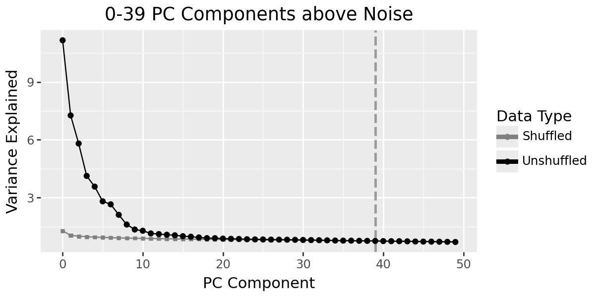

In this dataset, ~8–10 PCs are informative (`n_dims = 8`).

### 6. Archetypal Analysis — select number of archetypes
## Compute Archetype Selection Metrics (ParTI-py)

Now we use **ParTI-py** to compute archetype selection metrics across a range of archetype numbers (`k`).

### What This Step Does

1. **Sets the PCA embedding** for ParTI-py using the first `n_dims` PCs
2. **Computes selection metrics** for a range of `k` values (number of archetypes)
   - Metrics help decide the **optimal number of archetypes** to use downstream


- Make sure you've already decided on the **number of PCs (`n_dims`)** to use (see previous cell).
- The selection metrics (e.g., explained variance, residual sum of squares) will be stored in `adata` for downstream visualization.
- After running this, plot the metrics to identify the optimal `k` where adding more archetypes yields diminishing returns.

```python
n_dims = 8
pt.set_obsm(adata, obsm_key="X_pca", n_dimensions=n_dims)
pt.compute_selection_metrics(adata, n_archetypes_list=list(range(2, 8)))
```

## Archetype Number Selection (Diagnostics)

Before choosing a final number of archetypes, generate diagnostic plots to evaluate **stability**, **variance explained**, and **statistical significance** across multiple candidate values of optimal number of archetypes:

```python
plots_for_n_archetypes_selection(adata, n_archetype_range=range(3, 8), color="CellType")
```

This produces:

**Variance explained** — look for the elbow where gains diminish. This might be difficult for data with more continuous variation than that with discrete clusters:

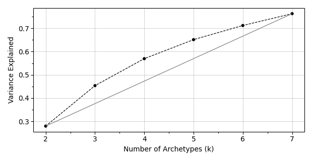

**Information Criterion (IC)** — look for the minimum:

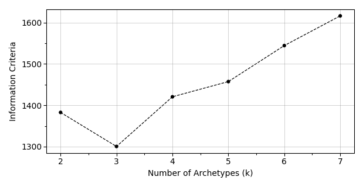

**Bootstrap variance** — lower = more stable archetypes:

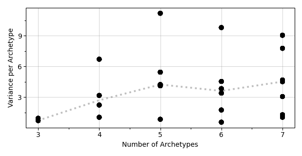

**T-ratio significance** — archetypes below p=0.05 are significantly better than random:

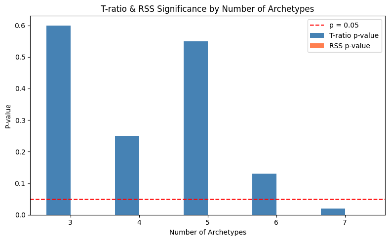

**2D archetype scatter plots** — one per k value, showing archetype locations in PC space:

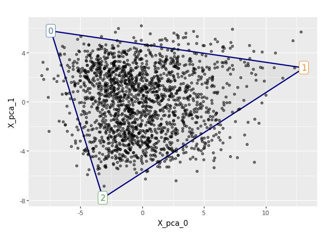
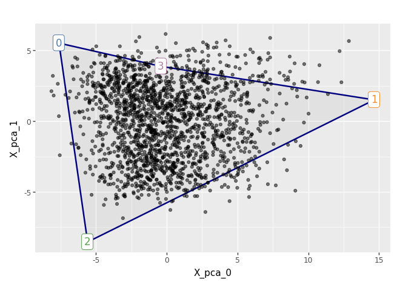
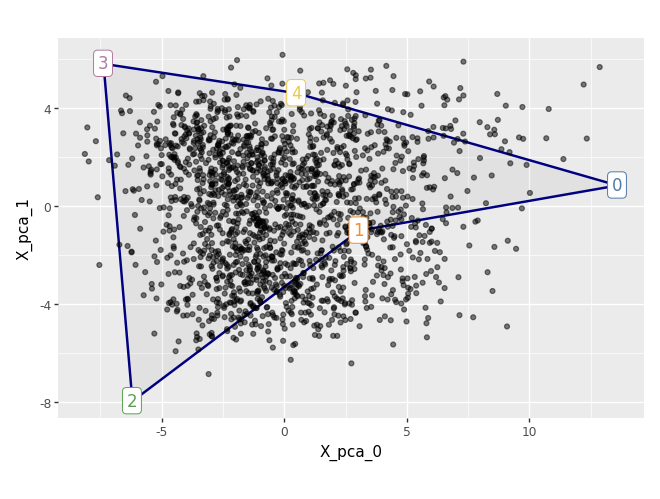
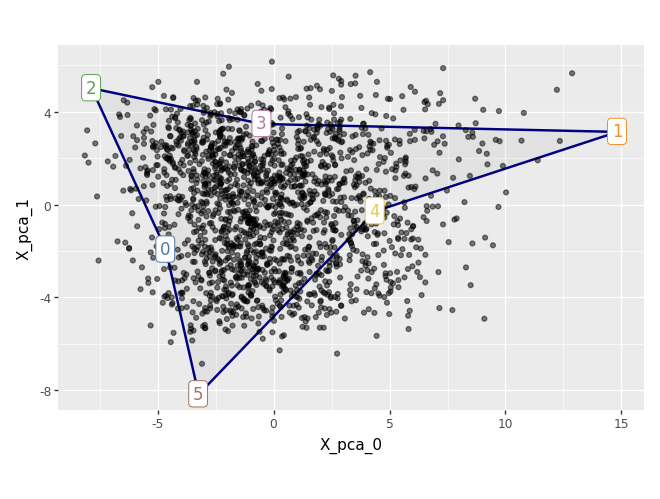
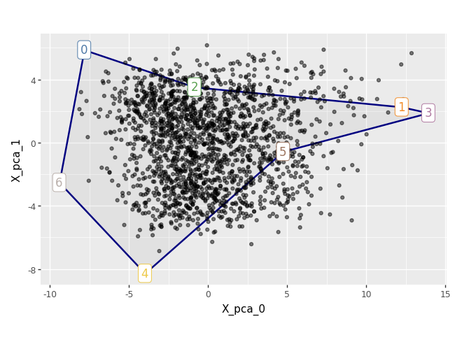

The decision-making here is subjective. For the sake of this tutorial, we went ahead with `n_archetypes = 3` as the most parsimonious solution.

### 7. Assign top n closest cells to archetypes
Identify the `top_n` cells closest to each archetype in PCA space and store the assignment in `adata.obs["archetype"]`.

```python
n_archetypes = 3

adata = get_top_cells_per_archetype(adata, n_archetypes=n_archetypes, top_n=200, n_dims=n_dims)
plot_top_cells_per_archetype(adata, dims=(0, 1))
```

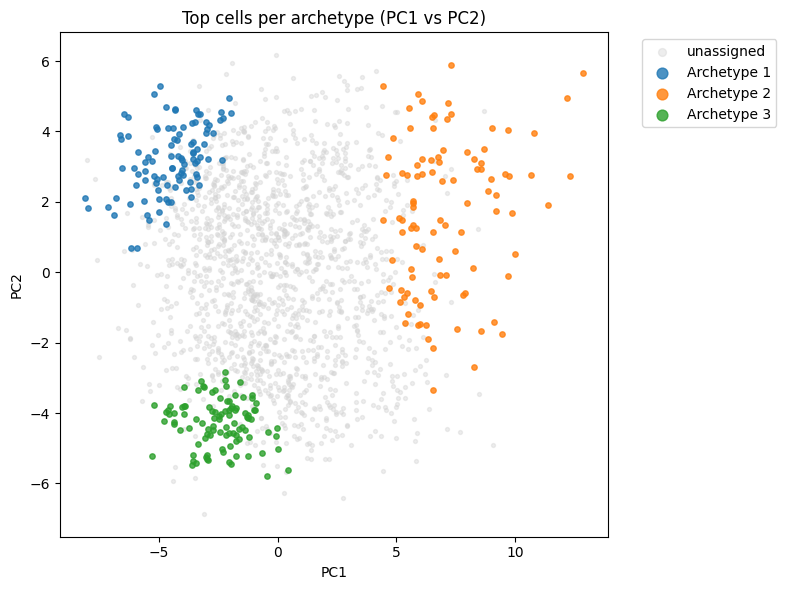

Each archetype occupies a distinct corner of PC space, consistent with the simplex structure.

### 8. Differential expression
Once cells have been assigned to their dominant archetype, run a **1-vs-rest differential expression analysis** to identify the marker genes that define each archetype.

**Prerequisites:** adata.obs must contain an "archetype" column (run get_top_cells_per_archetype first). Cells assigned 0 are treated as unassigned and excluded.

**1-vs-rest DEG** per archetype (Wilcoxon, all genes):
```python
deg_dict = run_deg_per_archetype(adata, lfc_threshold=1.0, pval_threshold=0.05)
```

**Pairwise DEG** (every archetype vs every other):
While 1-vs-rest DEG analysis identifies broad markers for each archetype, **pairwise comparisons** reveal genes that specifically distinguish one archetype from another — useful for understanding fine-grained biological differences between closely related archetypes.

```python
pairwise_deg_dict = run_pairwise_deg_per_archetype(adata, lfc_threshold=1.0, pval_threshold=0.05)
```

**Strict marker genes** (intersection of 1-vs-rest AND all pairwise comparisons):
After running both 1-vs-rest and pairwise DEG analyses, intersect the results to obtain a **strict set of marker genes** for each archetype — genes that are not just generally distinctive, but specifically upregulated against **every** other archetype.
```python
strict_genes_df = get_strict_archetype_genes(deg_dict, pairwise_deg_dict)
```

### 9. GO enrichment
At this point, we have identified **marker genes for each archetype** — genes that are 
differentially expressed in one archetype relative to all others. But a list of gene names 
doesn't tell us much on its own. To interpret *what each archetype is doing biologically*, 
we map these marker genes onto known gene ontology (GO) terms.

We use **Enrichr** (via `gseapy`) to test whether our marker genes are statistically 
overrepresented in any biological processes, molecular functions, or cellular components 
relative to what we'd expect by chance. Critically, we set the **background to all genes 
detected in our dataset** — not the entire genome — because we can only have detected 
enrichment for genes we actually measured.

A significant GO term tells us that an archetype is not just defined by random genes, 
but by genes that share a coherent biological role. This is how we go from 
*"archetype 2 exists"* to *"archetype 2 represents cells engaged in synaptic transmission"*.
**ORA (over-representation analysis)** using Enrichr with dataset-wide background:
```python
go_results = run_go_analysis(deg_dict, adata, organism="mouse", n_top_genes=200)

```
## Optionally, you may also run a GO analysis with "strict" archetype gene list
```python
strict_go_results = run_strict_go_analysis(strict_genes_df, adata, organism="mouse")
```

---

## Notes

- All intermediate Python utility functions live in `scripts/utils.py`. Import with `from scripts.utils import *` from the notebooks directory.
- All R utility functions live in `scripts/utils_R.R`. Source with `source("scripts/utils_R.R")`.
- `data/accessories/QC_genes.txt` — tab-separated file, first column is gene names to exclude from HVG selection (mitochondrial, ribosomal, sex-linked, etc.).
