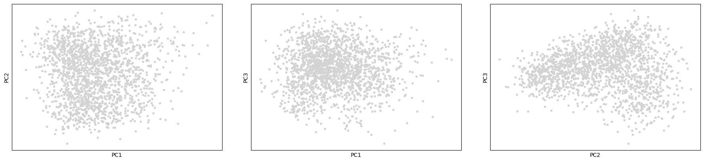

# Parti Pipeline

A two-stage single-cell RNA-seq analysis pipeline for transferring cell type annotations from a reference atlas and performing **Archetypal Analysis (AA)** to identify extreme gene expression programs within a population.

---

## Overview

```
Raw Counts (query + reference)
        │
        ▼
[Stage 1 — R]  01_transfer_annotation.R
        │  Load GSE115746 VISp reference
        │  Seurat anchor-based label transfer
        │  Export annotated query → .h5ad
        │
        ▼
[Stage 2 — Python]  notebooks/tutorial.ipynb
        │  QC checks
        │  Normalization, HVG selection, PCA
        │  Archetypal Analysis (partipy)
        │  DEG per archetype (1-vs-rest + pairwise)
        │  GO enrichment (ORA + GSEA)
        ▼
     Results
```

---

## Repository Structure

```
Parti_pipeline/
├── data/
│   ├── accessories/        # Accessory files (e.g. QC_genes.txt — gene exclusion list)
│   ├── processed/          # Output from Stage 1 (counts CSV, metadata CSV, .h5ad)
│   ├── ref/
│   │   └── raw/            # Reference data: GSE115746 counts + metadata (.csv.gz)
│   └── test/               # Small test datasets for pipeline validation
├── environment/            # Conda/pip environment files
├── notebooks/
│   └── tutorial.ipynb      # Main analysis notebook (Stage 2)
├── results/                # Final outputs: DEG tables, GO results, figures
├── scripts/
│   ├── 01_transfer_annotation.R   # Stage 1: label transfer (R)
│   ├── utils_R.R                  # R utility functions (load_seurat, plot_qc, etc.)
│   └── utils.py                   # Python utility functions (AA, DEG, GO, etc.)
└── README.md
```

---

## Dependencies

### R (Stage 1)
```r
install.packages(c("Seurat", "SeuratDisk", "Matrix", "optparse", "dplyr"))
BiocManager::install("glmGamPoi")   # optional but recommended for SCT
```

### Python (Stage 2)
```bash
conda env create -f environment/environment.yml
conda activate parti
# or manually:
pip install scanpy partipy gseapy anndata pandas numpy matplotlib scipy
```

---

## Stage 1 — Annotation Transfer (R)

**Script:** `scripts/01_transfer_annotation.R`

This script loads the [GSE115746](https://www.ncbi.nlm.nih.gov/geo/query/acc.cgi?acc=GSE115746) mouse visual cortex reference dataset, subsets it to the Primary Visual Cortex (VISp), and uses **Seurat's anchor-based transfer** to annotate cell subclasses in your query dataset.

### Required reference files

Download and place in `data/ref/raw/`:
- `GSE115746_controls_exon_counts.csv.gz`
- `GSE115746_complete_metadata_28706-cells.csv.gz`

### Usage

```bash
# Minimal — uses default reference paths
Rscript scripts/01_transfer_annotation.R --query data/raw/query.rds

# Full options
Rscript scripts/01_transfer_annotation.R \
  --query        data/raw/query.rds \
  --counts       data/ref/raw/GSE115746_controls_exon_counts.csv.gz \
  --meta         data/ref/raw/GSE115746_complete_metadata_28706-cells.csv.gz \
  --output       data/processed/query_annotated.h5ad \
  --normalization LogNormalize \   # or SCT
  --ndims        30 \
  --nfeatures    2000 \
  --k_weight     50 \
  --confidence_threshold 0.5
```

### Key parameters

| Parameter | Default | Description |
|---|---|---|
| `--query` | required | Path to query `.rds` Seurat object |
| `--normalization` | `LogNormalize` | `LogNormalize` or `SCT` |
| `--ndims` | `30` | Number of PCA dims for anchoring |
| `--nfeatures` | `2000` | Number of variable features |
| `--k_weight` | `50` | k.weight for TransferData (auto-reduces if too large) |
| `--confidence_threshold` | `0.5` | Min prediction score for confident calls |
| `--save_rds` | `FALSE` | Also save annotated query as `.rds` |
| `--save_ref_rds` | `FALSE` | Save processed reference as `.rds` |

### R utility functions (`utils_R.R`)

These functions can also be used interactively in an R session:

```r
source("scripts/utils_R.R")

# Load counts + metadata into a Seurat object
seu <- load_seurat(
  counts_path = "data/ref/raw/GSE115746_controls_exon_counts.csv.gz",
  meta_path   = "data/ref/raw/GSE115746_complete_metadata_28706-cells.csv.gz",
  project     = "GSE115746"
)

# QC plots — returns seu with pct.mt and pct.ribo added
seu <- plot_qc(seu, mt_pattern = "^mt-", ribo_pattern = "^Rp[sl]", group_by = "orig.ident")

# Filter after inspecting plots
seu <- subset(seu, nFeature_RNA > 500 & nFeature_RNA < 6000 & pct.mt < 15)

# Preprocess + transfer annotations
query <- preprocess_and_run_transferanchor(
  query           = query,
  reference       = ref,
  normalization   = "lognorm",   # or "SCT"
  ref_label_col   = "cell_subclass",
  query_label_col = "predicted_subclass",
  dims            = 1:30
)

# Export to .h5ad for Python
convert_to_h5ad(query, "data/processed/query_annotated.h5ad")
```

### Output

The script writes an `.h5ad` file to `data/processed/` with the following metadata columns added to cells:

| Column | Description |
|---|---|
| `transferred_subclass` | Predicted cell subclass label |
| `transfer_score` | Maximum prediction score (confidence) |
| `transfer_confident` | Boolean — score ≥ confidence threshold |
| `prediction.score.*` | Per-class prediction scores |

---

## Stage 2 — Archetypal Analysis (Python)

**Notebook:** `notebooks/tutorial.ipynb`

### 1. Load data

```python
import scanpy as sc
import pandas as pd
import sys
sys.path.append("..")
from scripts.utils import *

counts = pd.read_csv("../data/processed/output_counts.csv", index_col=0)
meta   = pd.read_csv("../data/processed/output_metadata.csv", index_col=0)
adata  = sc.AnnData(X=counts.T, obs=meta)
```

### 2. QC checks

Before preprocessing, verify that `adata.X` contains **raw integer counts** (not normalized):

```python
check_raw_integers_in_adataX(adata)
# Expected: 'adata.X contains only integers ✅'
```

### 3. Preprocessing

```python
QC_genes = pd.read_csv("../data/accessories/QC_genes.txt", sep="\t").iloc[:, 0].tolist()

preprocess_adata(
    adata,
    exclude_quality_genes = True,
    custom_exclude_genes  = QC_genes,
    n_pcs                 = 50,
    pca_seed              = 123
)
```

This performs: normalization → log1p → HVG selection → gene exclusion → z-score scaling (stored in `adata.layers["z_scaled"]`) → PCA.

Optionally apply Harmony batch correction:
```python
preprocess_adata(adata, apply_harmony=True, batch_key="Sample")
```

### 4. Visualize PCs

```python
sc.pl.pca_scatter(adata, components=['1,2', '1,3', '2,3'])
```



### 5. Determine number of informative PCs

```python
pt.compute_shuffled_pca(adata)
pt.plot_shuffled_pca(adata)   # look for where unshuffled crosses shuffled
```

The plot shows variance explained per PC for real vs. shuffled data. Use PCs up to where the real data curve meets the noise floor.


In this dataset, ~8–10 PCs are informative (`n_dims = 8`).

### 6. Archetypal Analysis — select number of archetypes

First compute selection metrics across a range of k:

```python
n_dims = 8
pt.set_obsm(adata, obsm_key="X_pca", n_dimensions=n_dims)
pt.compute_selection_metrics(adata, n_archetypes_list=list(range(2, 8)))
```

Then visualize all diagnostics at once:

```python
plots_for_n_archetypes_selection(adata, n_archetype_range=range(3, 8), color="CellType")
```

This produces:

**Variance explained** — look for the elbow where gains diminish:


**Information Criterion (IC)** — look for the minimum:


**Bootstrap variance** — lower = more stable archetypes:


**T-ratio significance** — archetypes below p=0.05 are significantly better than random:


**2D archetype scatter plots** — one per k value, showing archetype locations in PC space:


Based on IC minimum at k=3 and T-ratio significance at k=7, choose `n_archetypes = 3` as the most parsimonious solution.

### 7. Assign top cells to archetypes

```python
n_archetypes = 3

adata = get_top_cells_per_archetype(adata, n_archetypes=n_archetypes, top_n=200, n_dims=n_dims)
plot_top_cells_per_archetype(adata, dims=(0, 1))
```


Each archetype occupies a distinct corner of PC space, consistent with the simplex structure.

### 8. Differential expression

**1-vs-rest DEG** per archetype (Wilcoxon, all genes):
```python
deg_dict = run_deg_per_archetype(adata, lfc_threshold=1.0, pval_threshold=0.05)
deg_dict[1].head(20)
```

**Pairwise DEG** (every archetype vs every other):
```python
pairwise_deg_dict = run_pairwise_deg_per_archetype(adata, lfc_threshold=1.0, pval_threshold=0.05)
```

**Strict marker genes** (intersection of 1-vs-rest AND all pairwise comparisons):
```python
strict_genes_df = get_strict_archetype_genes(deg_dict, pairwise_deg_dict)
strict_genes_df.head(20)
```

### 9. GO enrichment

**ORA (over-representation analysis)** using Enrichr with dataset-wide background:
```python
go_results = run_go_analysis(deg_dict, adata, organism="mouse", n_top_genes=200)
go_results[1][["Gene_set", "Term", "Overlap", "Adjusted P-value", "Genes"]].head(20)
```

**Strict ORA** — intersect strict genes with 1-vs-rest before testing:
```python
strict_go_results = run_strict_go_analysis(strict_genes_df, deg_dict, adata, organism="mouse")
```

**GSEA (preranked)** — uses signal-to-noise ratio across all genes, no separate DEG step:
```python
gsea_results = run_gsea_per_archetype(adata, organism="mouse")
gsea_results[1].head(20)
```

---

## Notes

- All intermediate Python utility functions live in `scripts/utils.py`. Import with `from scripts.utils import *` from the notebooks directory.
- All R utility functions live in `scripts/utils_R.R`. Source with `source("scripts/utils_R.R")`.
- `data/processed/` is where Stage 1 writes outputs and Stage 2 reads inputs. Keep it in sync.
- `data/accessories/QC_genes.txt` — tab-separated file, first column is gene names to exclude from HVG selection (mitochondrial, ribosomal, sex-linked, etc.).
- Results (DEG tables, GO outputs, figures) should be written to `results/`.
